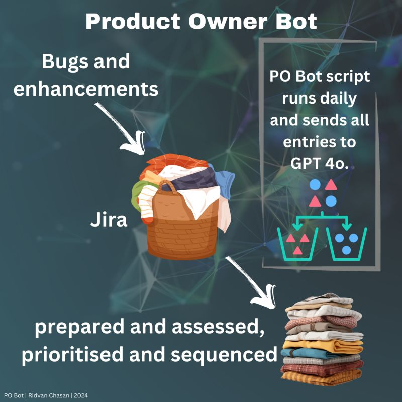

# product-owner-assistant-bot
An AI-powered assistant bot designed to support Product Owners in analyzing, evaluating, and improving their Jira projects.

## Overview
The **Product Owner Assistant Bot** is a Python-based AI assistant designed to streamline product management tasks and enhance productivity. It assists product owners by automating daily and weekly backlog reviews, enriching entries, and generating actionable insights.

## Features

- **Daily Review**: Scans new backlog entries daily.
- **Weekly Review**: Reviews all backlog entries weekly.
- **Entry Enrichment**: Sends backlog items to GPT-4o (with enhanced reasoning capabilities) to enrich them with additional context and information.
- **Relations Mapping**: Identifies and links similar entries to establish relations between them.
- **Priority & Effort Estimation**: Provides initial assessments of priority and required effort for each entry.
- **Solution Suggestions**: Generates potential solutions and recommendations for each backlog item.

## Requirements

To run the Product Owner Bot, you need the following:

- **Python**: Ensure Python is installed on your system.
- **OpenAI API**: Access to OpenAI's API for AI-driven enrichment and reasoning.
- **JIRA API Access**: Permissions to connect to and interact with your JIRA instance.

## Getting Started

TODO

## License

This project is licensed under the MIT License. See the LICENSE file for details.